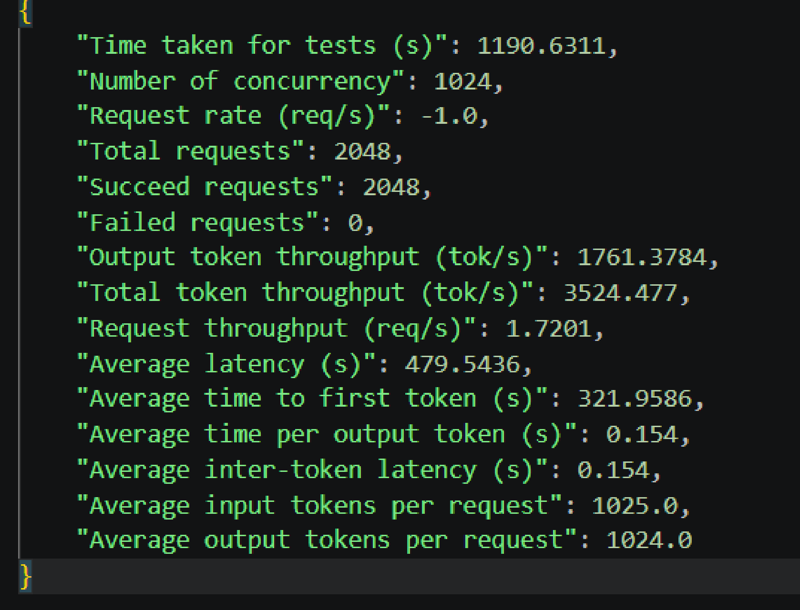
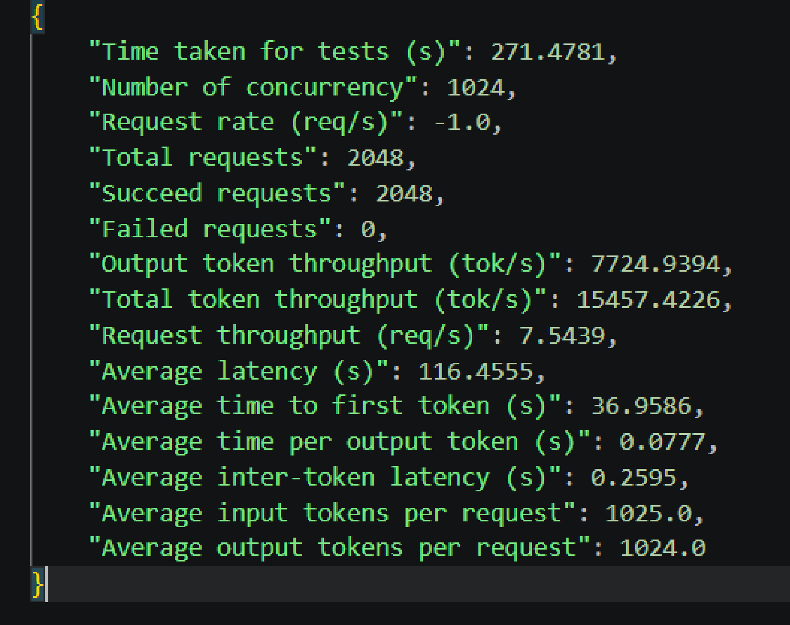
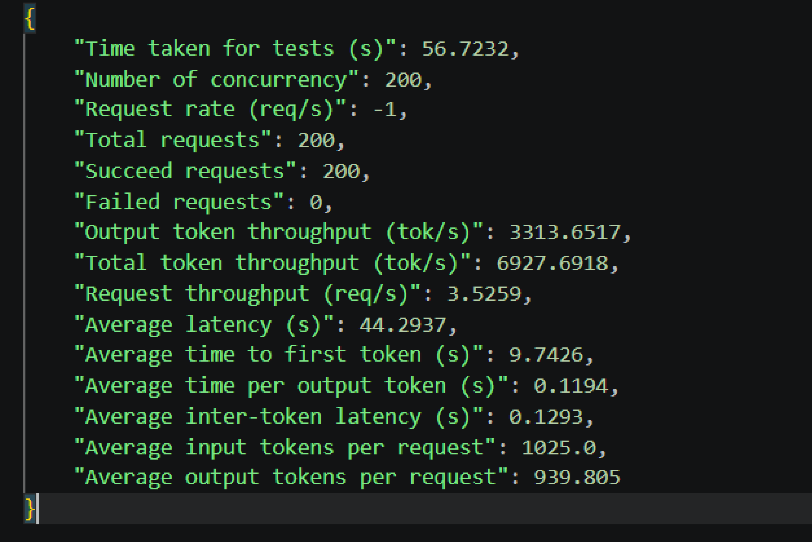
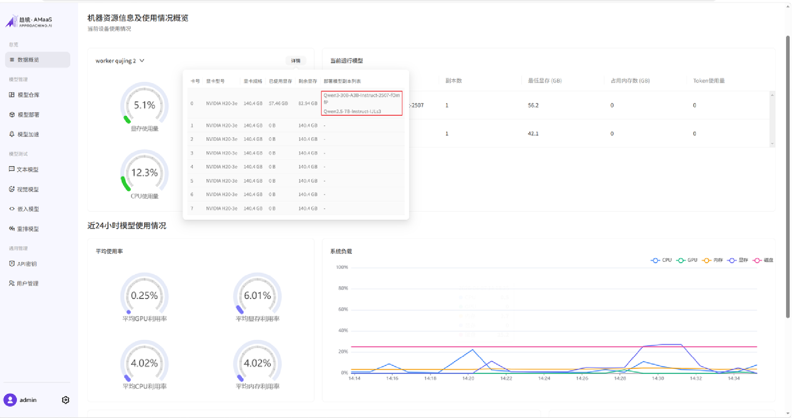
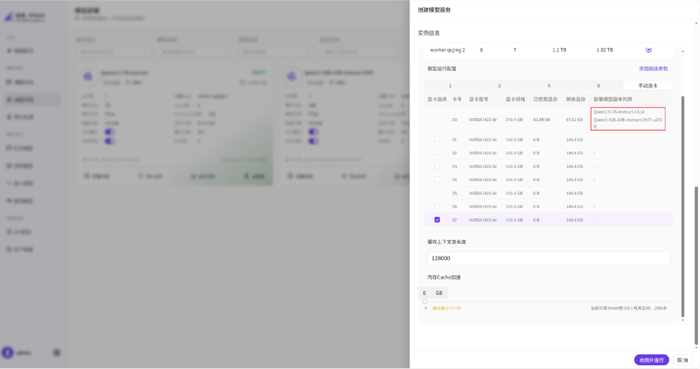
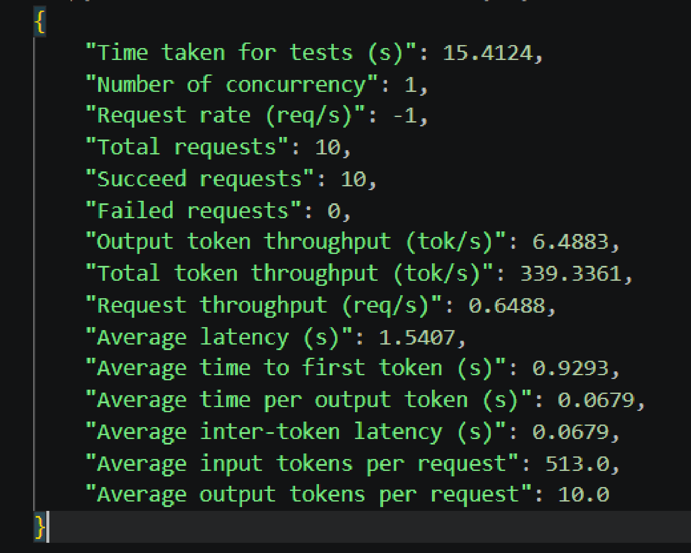
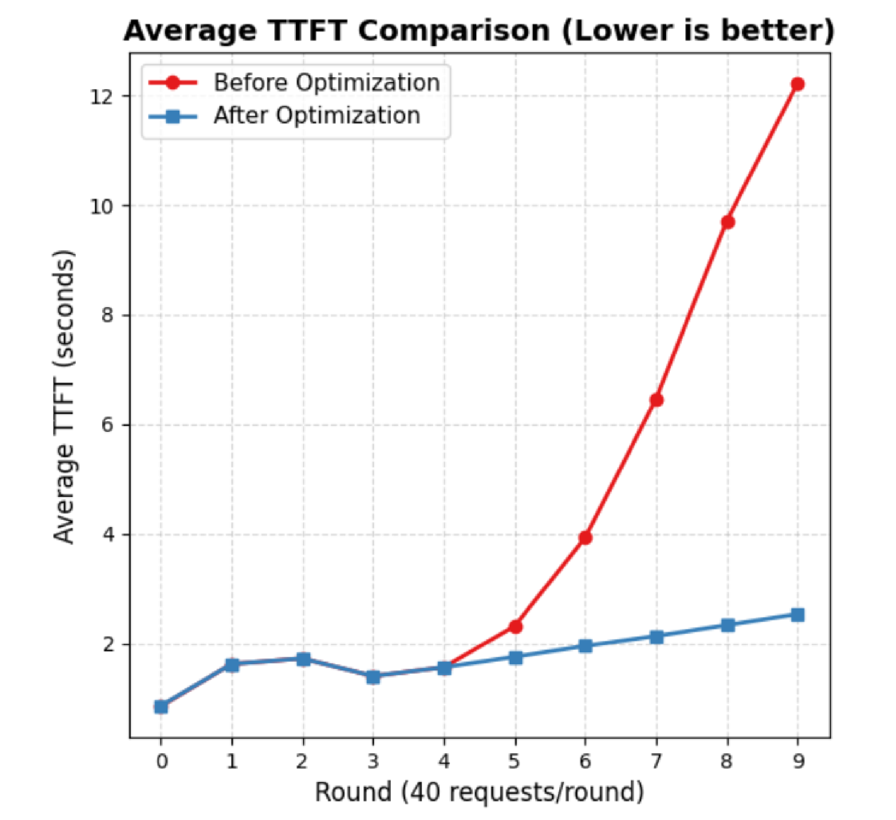
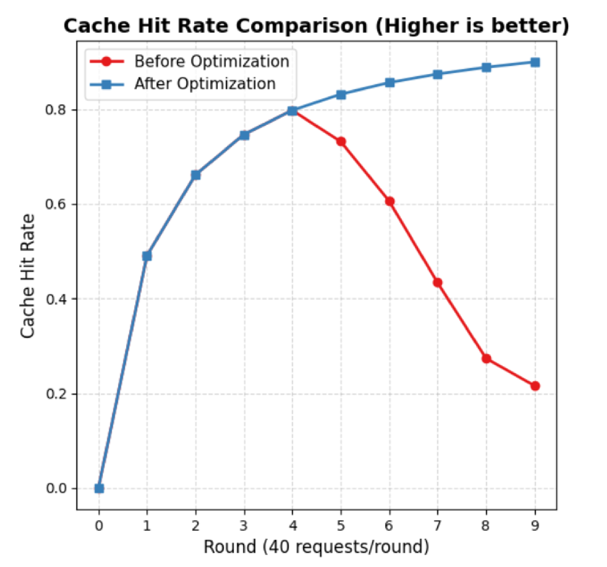

# 阳光保险 H20-141G-DeepSeek-R1-0528 POC 测试报告

## 1. 测试目的

在阳光保险提供的H20（141G）上，基于趋境科技的方案对DeepSeek-R1-0528开展POC测试。

## 2. 基本信息

| 项目 | 内容 |
|:---|:---|
| 项目 | 基于8卡H20（141GiB）的DeepSeek-R1-0528 POC测试 |
| 模型 | DeepSeek-R1-0528 |
| 时间 | 2026年4月3日 |

## 3. 测试环境

### 3.1 硬件配置

| 硬件 | 配置信息 |
|:---|:---|
| CPU | Intel(R) Xeon(R) 6759P-C（240 Core） |
| GPU | NVIDIA H20-3e(141GiB) * 8 |
| 内存 | 1.9Ti |

### 3.2 软件配置

| 软件名称 | 版本信息 |
|:---|:---|
| 操作系统 | Ubuntu |
| CUDA版本 | 12.8 |
| 测试工具 | evalscope v1.4.2 |

## 4. 测试用例

### 4.1 推理加速-PD分离性能

| 项目 | 内容 |
|:---|:---|
| 描述 | 厂商需在我单位2台H20组成的集群环境中，基于自研推理引擎实现DeepSeek-R1-671B-FP8模型PD分离深度推理优化，要求Token吞吐量相比2个独立H20模型实例之和提升1倍以上，并交付推理引擎组件与性能对比测试报告。 |
| 执行测试 | python3 run_perf_test.py --port 35000 --model DeepSeek-R1-0528 --tokenizer-path /mnt/raid/models/DeepSeek-R1-0528/ --input-length 1024 --output-length 1024 --parallel "1024" --number "1024" |
| 数据 | - 单机数据 - 1P1D数据 |

| 是否通过 | 是 |
|:---:|:---:|

### 4.2 推理加速-单机推理性能

| 项目 | 内容 |
|:---|:---|
| 描述 | 厂商需在我单位单台H20上，基于自研推理引擎实现DeepSeek-R1-671B-FP8模型深度推理优化，在输入1K，输出1K的场景，Token输出速度超过3000token/s，并交付性能测试报告。 |
| 执行测试 | python3 run_perf_test.py --port 35000 --model DeepSeek-R1-0528 --tokenizer-path /mnt/raid/models/DeepSeek-R1-0528/ --input-length 1024 --output-length 1000 --parallel "200" --number "200" |

| 是否通过 | 是 |
|:---:|:---:|

### 4.3 算力拆分

| 项目 | 内容 |
|:---|:---|
| 描述 | 支持在单张物理GPU硬件资源上同时承载多个独立的大模型推理实例，需具备精细化显存资源调度能力，可通过动态显存分配、模型权重共享等技术，实现对GPU显存、计算单元等硬件资源的逻辑隔离与弹性分配，避免多实例间资源抢占冲突，保障多实例并发部署时的推理性能稳定性，并交付测试报告。 |
| 执行测试 | 基于AMaaS平台手动选卡，内部会根据模型配置和启动参数拆分算力，且实例间互不影响。 |

| 是否通过 | 是 |
|:---:|:---:|

### 4.4 算力超分

| 项目 | 内容 |
|:---|:---|
| 描述 | 支持DeepSeek-R1-671B-FP8精度模型在单机单卡H20硬件环境部署，Prefill速度达到300token/s，Decode速度达到15token/s，并交付测试报告。 |
| 执行测试 | python3 run_perf_test.py --port 35000 --model DeepSeek-R1-0528 --tokenizer-path /mnt/raid/models/DeepSeek-R1-0528/ --input-length 512 --output-length 10 --parallel "1" --number "1" |

| 是否通过 | 是 |
|:---:|:---:|

### 4.5 多轮对话场景

| 项目 | 内容 |
|:---|:---|
| 描述 | 模拟真实高并发客服业务场景，验证推理引擎在多用户同时进行多轮对话时的性能表现。重点测试系统对历史对话记录的KV Cache缓存与复用能力。通过在多轮交互中减少重复计算，验证其能否有效降低首字延迟（TTFT）并提升并发承载能力，确保在长上下文链路下用户仍能获得极速的响应体验，并交付多用户场景下的性能测试报告。 |
| 执行测试 | python3 bench_multiturn.py --model-path /mnt/data/models/DeepSeek-R1-0528 --port 35000 --disable-random-sample --output-length 1 --request-length 3000 --num-clients 40 --num-rounds 10 --max-parallel 4 --request-rate 16 --ready-queue-policy random --disable-auto-run --enable-round-barrier --dataset-path /mnt/data/models/perftest/sharegtp_dataset/ShareGPT_V3_unfiltered_cleaned_split.json |

| 是否通过 | 是 |
|:---:|:---:|

## 5. 测试结论

- pd分离性能Token吞吐量能达到2个独立H20模型实例之和的1倍以上 ✅
- 输入1k输出1k的场景，Token输出速度可以超过3000token/s ✅
- 支持单张物理GPU的算力拆分，在单张物理GPU硬件资源上同时承载多个独立的大模型推理实例 ✅
- 单卡kt异构prefill速度可以达到300token/s，Decode速度达到14.73token/s ✅
- 高并发多轮对话测试中，开启优化方案后，首字延迟（TTFT）随轮次增长保持极高稳定性。在第10轮交互时，TTFT仅为2.53s，相比未开启状态（12.22s）降低了4.8倍，且缓存命中率稳定在90%左右。 ✅

## 6. 附件

- 详细的硬件信息
- 单机常规性能基线数据
- 1P1D常规性能数据